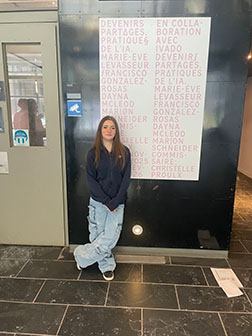
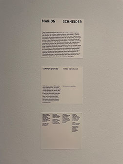
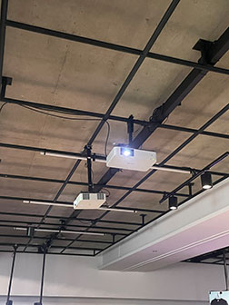

# Devenir Partagés. Pratiques de l'IA
## Lieu de mise en exposition
- Galerie de l'Université de Montréal
  

## Type d'exposition
- *Devenir partagés. Pratiques de l'IA* est une exposition intérieure temporaire portant place à la galerie de l'UDEM du 28 novembre jusqu'au 28 février
## Date de visite
- J'ai eu l'opportunité d'aller voir cette exposition dans le cadre du cours *Oeuvres et dispositifs multimédias* le 30 janvier 2026
## Titre de l'oeuvre
- Terre commune
## Nom de l'artiste
- Marion Schneider
# Année de la réalisation
- L'oeuvre a été réalisée en 2025
## Description de l'oeuvre

## Type d'installation
- L'installation est immersive, interactive et contemplative.

  
  
## Mise en espace 
- Voici un croquis illustrant l'installation dans la pièce
  

## Composantes et techniques
- L'installation utilise un bandeau connecté à un ordinateur entreposant lui même sa propre base de données pleine de photos de sols forestiers et qui contient une IA générative entrainée à produire des représentations à partir des photos et des données du bandeau collectant les ondes alpha de votre cerveau.
## Éléments nécessaires à la mise en exposition
- Mur
- Projecteur
- Banc
- Ordinateur
- Bandeau capteur d'ondes alpha
- Écran qui affiche les ondes  captées
- Structure en métal soutenant le projecteur
  

## Mon expérience
### Ce qui m'a plus
J'ai beaucoup apprécié l'idée de marier l'ordinateur et l'humain, c'est un thème qui peut facilement faire contreverse mais selon moi ca a été executé avec finesse et de manière intéressante.
### Ce que je ferais autrement
J'aurais trouvé intéressant qu'il y ait plusieurs bandeaux pour que plusieurs personnes puissent partager l'expérience au même moment, ce qui alternerait les résultats de l'oeuvre.
