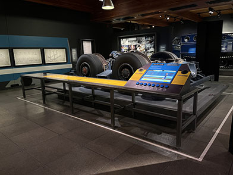
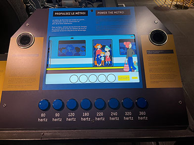

# Compte-rendu
## Conférence Martin Boucher
Aujourd’hui, en classe, nous avons eu la chance d’accueillir Martin Boucher, un technicien multimédia polyvalent provenant du Musée de l’ingéniosité J. Armand-Bombardier. Cette rencontre nous a permis de découvrir les dispositifs qu’ils mettent en œuvre, leurs particularités, mais surtout d’en apprendre davantage sur ces installations parfois mystérieuses et d’élargir notre palmarès de ressources.

---
## Les grandes lignes
La conférence a débuté par la présentation des différents domaines auxquels un technicien multimédia est confronté au quotidien. Parmi ceux-ci, Martin Boucher a notamment mentionné l’audio, l’informatique et les systèmes interactifs. Il a expliqué que ces compétences sont essentielles pour concevoir et maintenir des installations fonctionnelles et attrayantes pour des publics de tous âges. Ensuite, il a présenté certains dispositifs utilisés dans les expositions du musée, leurs fonctionnement et emplacement. En passant par là, il nous a aussi tenu compte de l'importance d'être curieux dans le domaine. Par exemple, il nous a présenté différents types de branchements et de dispositifs, chacun ayant une fonction spécifique, afin de nous montrer l’importance de se documenter pour enrichir nos connaissances, mais surtout de développer la capacité d’identifier d'où provient un problème en se basant sur sa nature. Finalement, il a abordé l’installation du bogie de métro, un dispositif interactif unique. Cet exemple a permis de démontrer comment des éléments techniques et mécaniques peuvent être intégrés dans une exposition afin de les rendre accessibles et intéressants pour les visiteurs. Il a toutefois reconnu avec humilité certaines limites de cette installation, notamment le fait qu’elle pouvait être trop complexe et moins bien adaptée à un jeune public. Il a ensuite terminé avec un bref discours sur l’importance de la documentation et de son partage dans le cadre de projets professionnels, que ce soit en équipe ou individuel. Il a souligné que bien documenter son travail permet non seulement de mieux organiser ses idées, mais aussi de faciliter la collaboration, la résolution de problèmes et la continuité des projets.

 
 
 > Voici le bogie de métro et son tableau de commande
 
---
En conclusion, j’ai beaucoup apprécié cette conférence ainsi que le message transmis par le conférencier. J’ai particulièrement eu un coup de cœur pour l’installation du bogie de métro, car je n’avais jamais eu l’occasion de voir ce type de dispositif auparavant. Cet exemple concret m’a permis de mieux comprendre comment la technologie et la mécanique peuvent être mises en valeur dans un contexte muséal. Bref, la présentation a suscité mon intérêt et m’a donné envie de visiter le Musée de l'ingéniosité afin d’en découvrir davantage.

