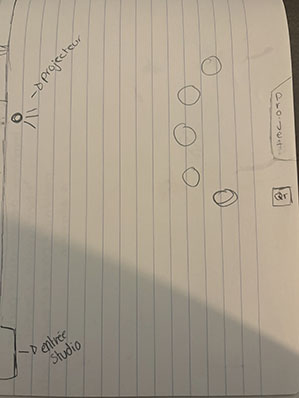
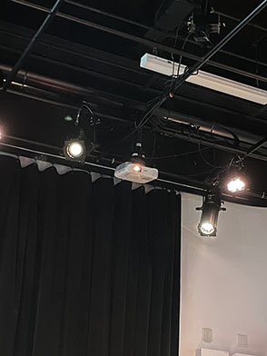
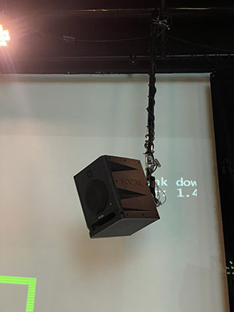
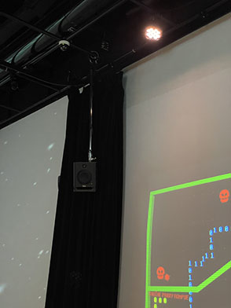
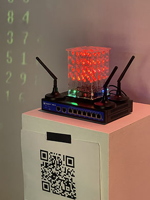

# Expositions finissants
## Lieu de mise en exposition
Cette exposition a eu lieu au Collège Montmorency, dans le grand studio de TIM.

> Me voici devant l'exposition
## Type d'exposition
Cette exposition était temporaire et intérieure.
## Date de visite
J'ai visité cette exposition une première fois le 24 février et une deuxième fois le 17 mars 2026.
## Titre de l'œuvre
Terminal
## Nom des artistes
- Émeryk Bélisle
- Elie Daher
- Ting Yung Lu Terry
- Dana Saavedra-Torrano
- Mégane Ranger
# Année de la réalisation
Cette exposition a été conçue en 2025 dans le cadre du cours *Expérience multimédia intéractive* pour leur projet collaboratif et interactif de fin de programme.
## Description de l'œuvre
*Terminal* est un jeu collaboratif où plusieurs joueurs contrôlent un opérateur avec leurs téléphones. Leur objectif est de traverser des niveaux pour restaurer des données après une cyberattaque. En se déplaçant, ils laissent des traces qui deviennent des obstacles pour les autres, ce qui rend la progression plus difficile. Si un joueur échoue, tout le monde doit recommencer et les niveaux deviennent de plus en plus complexes.

> Voici le cartel de Terminal
## Type d'installation
Il s'agit d'une installation interactive
## Mise en espace 

> Voici mon croquis de l'installation
## Composantes et techniques
- Projecteurs

> Voici le projecteur
- Lumières
- Hauts-parleurs

> Voici les hauts-parleurs
- Site web du jeu
- Code Qr pour jouer sans internet

> Voici le code Qr pour jouer sans Wi-Fi
## Éléments nécessaires à la mise en exposition
- Poufs pour s'asseoir
- Pièce alimentée d'électricité
- Mur vierge
- Téléphone
## Mon expérience
### Ce qui m'a plus
J’ai particulièrement apprécié l’ambiance de cette œuvre, autant au niveau des visuels du jeu que des sons et des accessoires, rien n’avait été laissé de côté. L’ensemble formait une expérience cohérente et bien pensée. Selon moi, il s’agissait de l’œuvre la plus complète de l’exposition, et celle dont l’immersion était la plus réussie et la plus convaincante.
### Ce que je ferais autrement
Selon moi, le projet était déjà assez complet et bien construit, ce qui fait qu’il n’y aurait pas grand-chose à ajouter sur le contenu global. La seule amélioration que j’envisagerais serait au niveau de la complexité des niveaux, qui m’a semblé un peu trop simple. En augmentant légèrement la difficulté ou en ajoutant davantage de défis, l’expérience pourrait devenir plus stimulante et engageante sur la durée.
# Références
[Lien vers le github de Terminal](https://pythons-5.github.io/Terminal/#/)

