# Expo Réseau Vivant
## Palmarès exposition des étudiants TIM
 En somme, je souhaite souligner le travail et les efforts de tous ces étudiants finissants, qui ont su rassembler leurs forces et leurs idées pour créer des projets interactifs à la fois divertissants et bien réalisés. Leur implication reflète sur la qualité des projets présentés.
 
## TERMINAL
### Noms des créateurs et créatrices:
- Émeryk Bélisle
- Elie Daher
- Ting Yung Lu Terry
- Dana Saavedra-Torrano
- Mégane Ranger

### Installation en cours (ou finale)
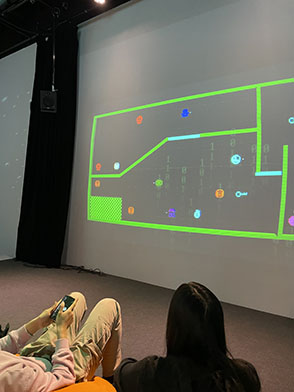
> Voici l'installation finale de terminal
### Schéma de l'installation prévue
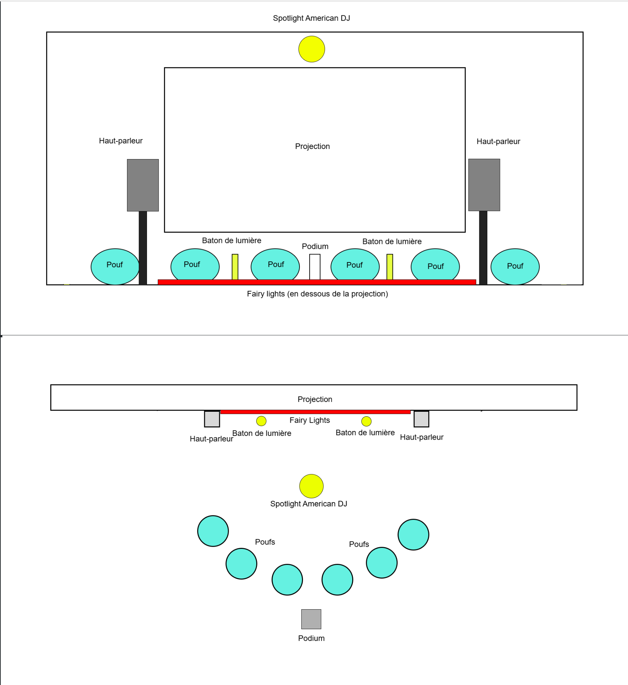
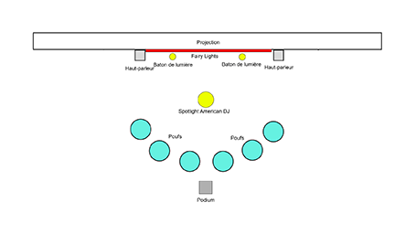
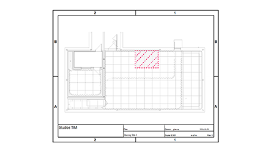
> Schémas d'implantation 2D
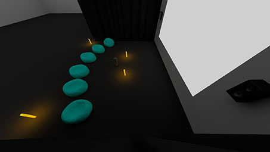
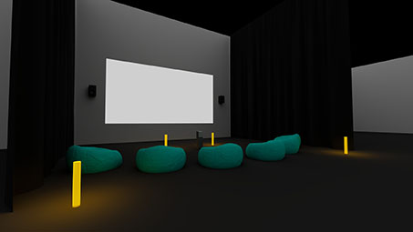
> Schémas d'implantation 3D
### Ce que vous ressentez en expérimentant chacune des installations, avec justification (avant/après l'expérimentation)
Avant l’expérimentation, j’étais déjà très enthousiaste face à la présentation, notamment les lumières, les sons et les poufs pour s’asseoir. Par la suite, cet enthousiasme s’est maintenu, puisque le jeu fonctionnait très bien et offrait une expérience fluide.

---
## Mission décollage ( O.I.G.N.I.O.N )
### Noms des créateurs et créatrices:
- Ahmed Kaissoumi
- Radhouane Kordan
- Justin Montpetit
- Thearylou Lach
- Jad Saloumi
### Installation en cours (ou finale)
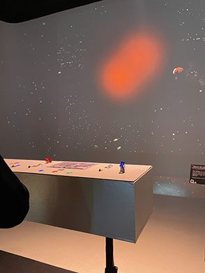
> Voici l'installation finale de Mission décollage
### Schéma de l'installation prévue
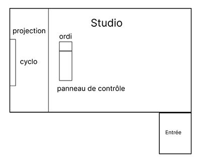
> Schéma 2D Mission décollage

### Ce que vous ressentez en expérimentant chacune des installations, avec justification (avant/après l'expérimentation)
J’étais d’abord très intriguée par ce projet, surtout par le tableau de bord qui m’a immédiatement marquée, c'était une idée vraiment ingénieuse. Cependant, j’ai un peu moins apprécié le jeu par la suite, il était globalement fluide, mais présentait parfois quelques "bugs" qui faisaient perdre le fil de l’expérience.

---

 
## Symbiose
### Noms des créateurs et créatrices:
- Yannick Chamberland
- Benjamin Ferland
- Ryan Dufault
- Walid Cheour
### Installation en cours (ou finale)
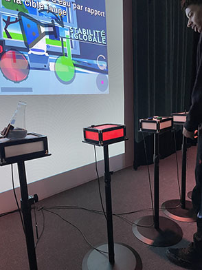
> Voici l'installation finale de Symbiose
### Schéma de l'installation prévue

> Schéma d'implantation 2D
### Ce que vous ressentez en expérimentant chacune des installations, avec justification (avant/après l'expérimentation)
Cette œuvre m’intriguait beaucoup, notamment parce que j’apprécie la science et les concepts qui s’y rattachent. Cependant, les "bugs" étaient trop fréquents, ce qui rendait l’expérience difficile à compléter et empêchait d’en profiter pleinement.
 
---
## Arbre-en-face
### Noms des créateurs et créatrices:
- Alexandre Gendron
- Mikael Arseneau
- Mathieu Willet
- Matis Ghariani
- Rafael Angon Dube
### Installation en cours (ou finale)
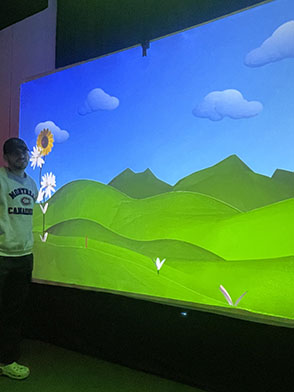
> Voici l'installation finale d'Arbre-en-face
### Schéma de l'installation prévue

> Schéma d'implantation 2D
### Ce que vous ressentez en expérimentant chacune des installations, avec justification (avant/après l'expérimentation)
J’ai été surprise et un peu déstabilisée par la présentation de ce projet, dont le concept n’était pas très clair au départ. Après l’avoir expérimenté, je dois avouer avoir été quelque peu déçue par l’œuvre. Même si le fonctionnement était bien exécuté, le thème ne m’a pas particulièrement interpellée.

---
## Quand les yeux se croisent
### Noms des créateurs et créatrices:
- Edelwin Ledru
- Félix Lavoie
- Jade Hébert
- Manel Yaya
- Patricia Nassif
### Installation en cours (ou finale)
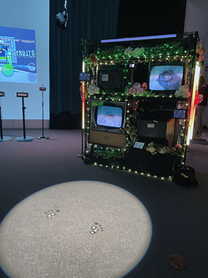
> Voici l'installation finale de Quand les yeux se croisent
### Schéma de l'installation prévue

> Schéma d'implantation 2D
### Ce que vous ressentez en expérimentant chacune des installations, avec justification (avant/après l'expérimentation)
Cette oeuvre m’a d’abord surprise. Au premier abord, je ne comprenais pas vraiment le but et je me suis surtout laissée porter par l’esthétique de l’installation, en admirant la présentation soignée des plantes et des télévisions. Puis, en découvrant progressivement le concept, j’ai beaucoup apprécié l’expérience. La simplicité du projet en faisait justement tout son charme, rendant l’ensemble à la fois accessible et agréable à explorer.

---
## Océan rouge
### Noms des créateurs et créatrices:
- Amira Tounekti
- Kristy Moussally
### Installation en cours (ou finale)
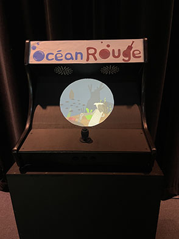
> Voici l'installation finale d'Océan rouge
 
### Schéma de l'installation prévue

> Schéma d'implantation 2D
 
 
### Ce que vous ressentez en expérimentant chacune des installations, avec justification (avant/après l'expérimentation)
J’étais premièrement très investie dans la présentation, puisque j’adore les arcades. Cependant, j’ai trouvé que le jeu était un peu trop simple et qu’il manquait d’un réel objectif, ce qui rendait l’expérience moins engageante.

---
## Trois cours du programme qui vous semblent incontournables pour avoir les compétences pour créer ce genre de projet
### Programmation interactive 
La programmation interactive est essentielle pour ce type de projet, puisqu’elle permet de rendre l’oeuvre réactive aux actions de l’utilisateur. Par exemple, dans le projet où l’on pouvait faire pousser des plantes en touchant l’écran, c’est grâce à la programmation que chaque interaction déclenche une transformation visuelle en temps réel.

### Web
Le web est un incontournable, car il permet de créer des interfaces et de relier différents appareils entre eux. Par exemple, pour un jeu où le téléphone sert de manette, comme Terminal,  il faut une base web pour que tout fonctionne ensemble. Ce sont des compétences utiles dans la majorité des projets interactifs.

### Modelisation 3D
La modélisation 3D est également très importante, puisqu’elle aide à concevoir et à visualiser les environnements avant même leur réalisation. Elle permet de mieux planifier les éléments visuels et de créer des univers cohérents, ce qui est essentiel pour offrir une expérience immersive et bien pensée.
## Nommer et décrire une technique ou une composante technologique qui est utilisée dans l'un des projets et que vous ne connaissiez pas.

